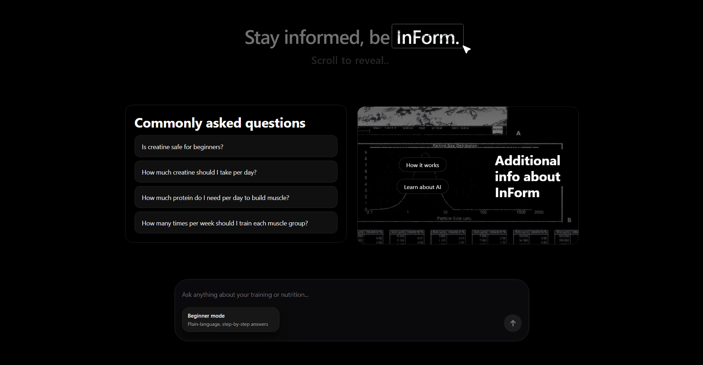

# InForm

  

  🔗 <a href="https://informapp.dev/">https://informapp.dev/</a>

**Try it:** Ask “How often should I train each muscle group?” and switch between Beginner and Intermediate modes

**InForm** is an evidence-based AI assistant for training and nutrition

It combines a modern conversational UI with a **retrieval-augmented backend grounded in peer-reviewed research**. The project is built as a **production-style, full-stack system** to demonstrate fundamentals, clean API design, and product decisions

---

## Problem & Approach

Most fitness and nutrition apps rely on generic advice or opaque AI outputs

InForm addresses this by:

- Grounding answers in **retrieved research passages**
- Adapting explanation depth via **Beginner / Intermediate modes**
- Exposing **citations and confidence** to the user

---

## Core Capabilities

- Evidence-based Q&A for training, nutrition, recovery, and supplements
- Retrieval-Augmented Generation (RAG) over curated studies
- Mode-aware responses (beginner vs. intermediate)
- Confidence scoring and explicit citations

---

## Docs

- Architecture: `docs/architecture.md`
- Retrieval & grounding: `docs/retrieval.md`
- Evaluation: `docs/evaluation.md`
- Corpus updates: `docs/corpus_update.md`

---

## Evaluation snapshot

- Corpus: 115 curated studies (CSV + JSON passages)
- Batch eval: 99 answers - avg 620 chars, 1.63 citations/answer
- Confidence: 56.6% high / 23.2% medium / 20.2% low
- Production model: gpt-3.5-turbo (~3-8s typical)

---

## Tech Stack

**Frontend:** Vite + React + TypeScript, Tailwind, shadcn/ui  
**Backend:** FastAPI (Python)  
**Retrieval:** Hybrid TF-IDF + dense embeddings (SentenceTransformer `all-MiniLM-L6-v2`)  
**Grounding:** Inline citations + post-generation citation validation/renumbering

## License

MIT License
