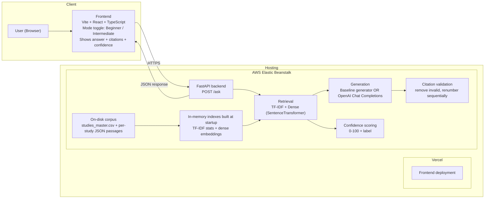
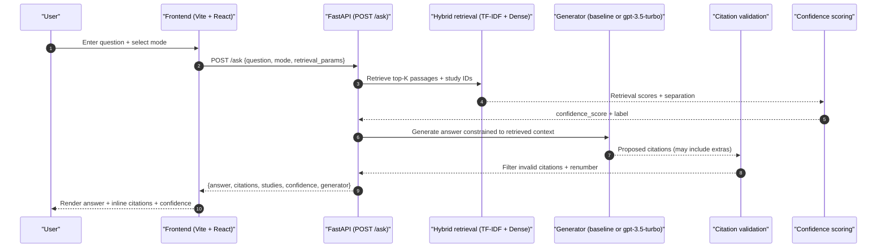
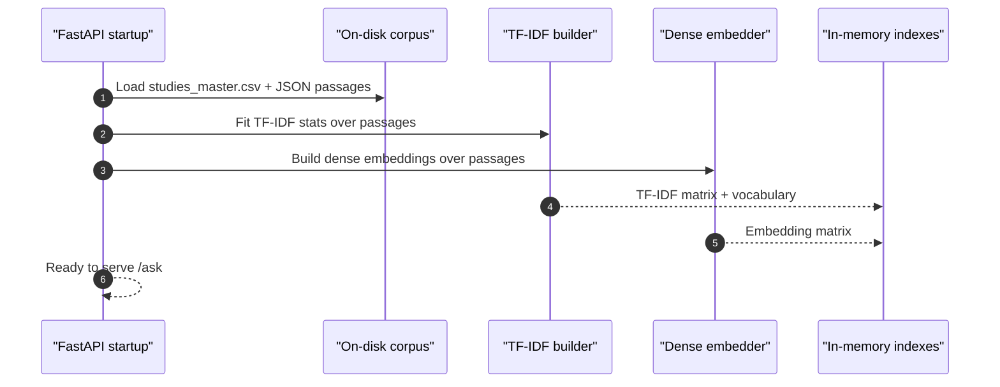

# InForm - Architecture

InForm is an evidence-grounded Q&A system for training, supplementation, and nutrition. It answers **only using a curated on-disk corpus** of studies, and returns **inline numeric citations** plus a **retrieval-based confidence** score

**Note:** the corpus is stored on-disk on the server; **TF-IDF stats and dense embeddings are built in-memory at startup**

---

## High-level system diagram

## Request path (runtime)

## Startup path (index build)

